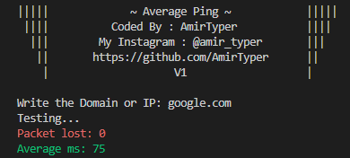

# Average-Ping
A simple script to get the average ms when you are pinging a host.

 

 

# How to use:
<pre><code>git clone https://github.com/AmirTyper/Average-Ping
cd Average-Ping
pip install -r requirements.txt
python ping.py
</code></pre>

# Support me
The easiest way to support me is to click on the star (<g-emoji class="g-emoji" alias="star" fallback-src="https://github.githubassets.com/images/icons/emoji/unicode/2b50.png">⭐</g-emoji>) at the top of <a href="https://github.com/AmirTyper/Average-Ping">GitHub page</a>.

# Contact me
<pre><code>Developer's Telegram: <a href="https://t.me/Mr_Amir_Typer">Mr_Amir_Typer</a>
Developer's Instagram: <a href="https://instagram.com/amir_typer">amir_typer</a>
Developer's Twitter: <a href="https://twitter.com/AmirTyper">AmirTyper</a>
My Website: <a href="https://amirtyper.ir">amirtyper.ir</a>
</code></pre>
